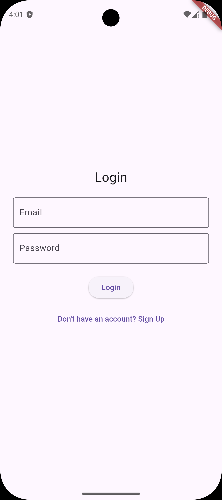
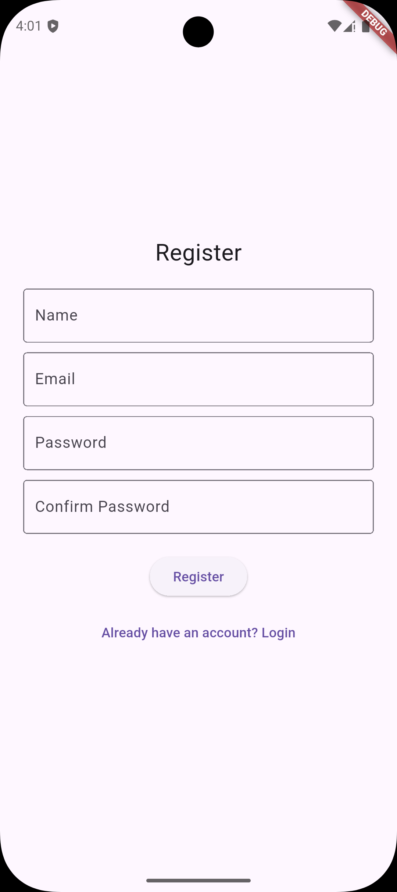
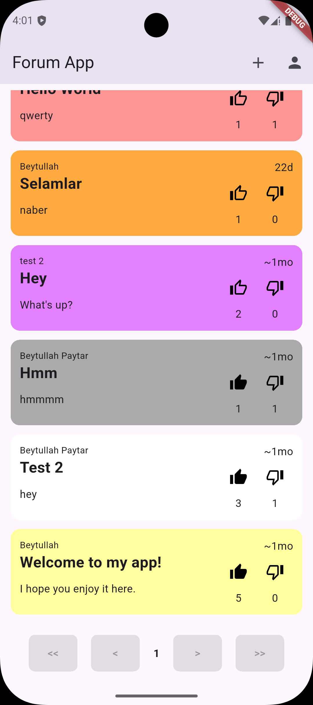
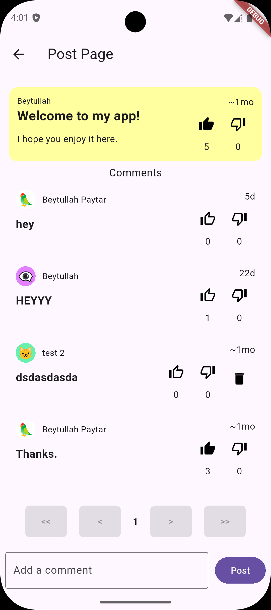
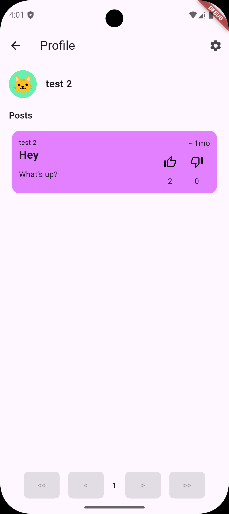
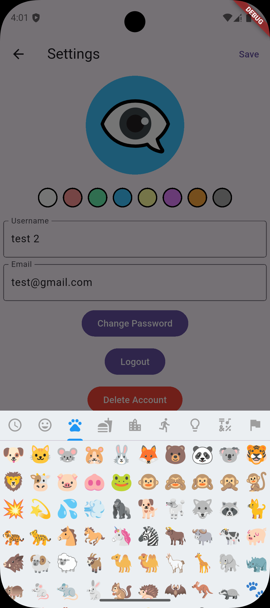
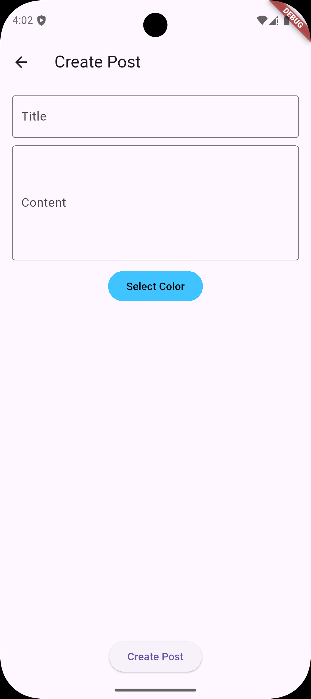
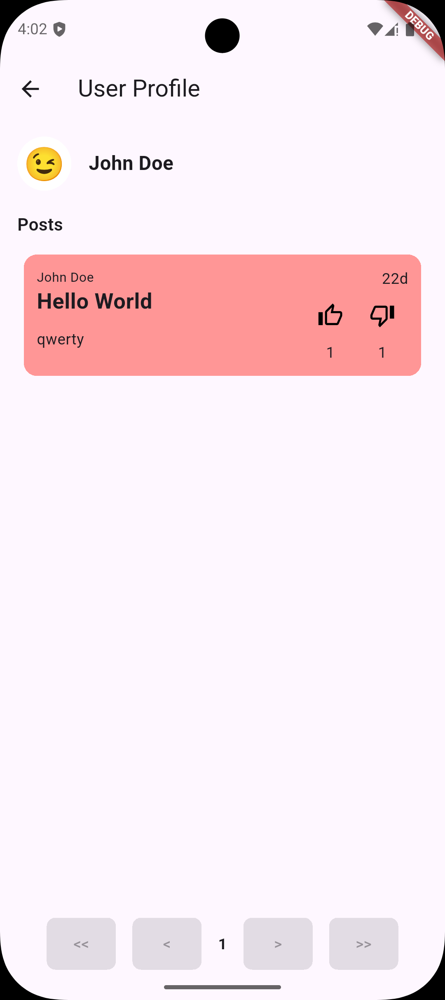

> **Note:** The hosted API is available until **December 11, 2025**. After that, it may be taken down or replaced.

# Forum App Mobile

This is a mobile forum app developed as the final project for the **SE-017 - Mobile Applications** course at Estonian Entrepreneurship University of Applied Sciences during the **Spring 2025 semester**.

Built with **Flutter** and **Dart**, the app features user authentication, profile management, and full post/comment interactions. It supports creating, reading, updating, and deleting posts and comments, as well as liking/disliking content and customizing user profiles.

---

## 🛠️ Used Technologies

**Frontend:**
- Flutter (Dart)
- Android Studio
- `http` package for API communication
- `shared_preferences` for local auth token storage
- `emoji_picker_flutter` for user profile image customization

**Backend:**
- Laravel 11 (REST API)
- Sanctum for authentication
- Hosted on: [https://beytullahpaytar.com.tr/](https://beytullahpaytar.com.tr/)

---

## 🔗 Links

- 📦 Laravel Backend Source: [ForumAppAPI-Laravel](https://github.com/Beytullahp42/ForumAppAPI-Laravel)
- 🌐 Flutter Web App: [beytullahpaytar.xyz](https://beytullahpaytar.xyz)

---

## 📸 Screenshots

 
 
 
 